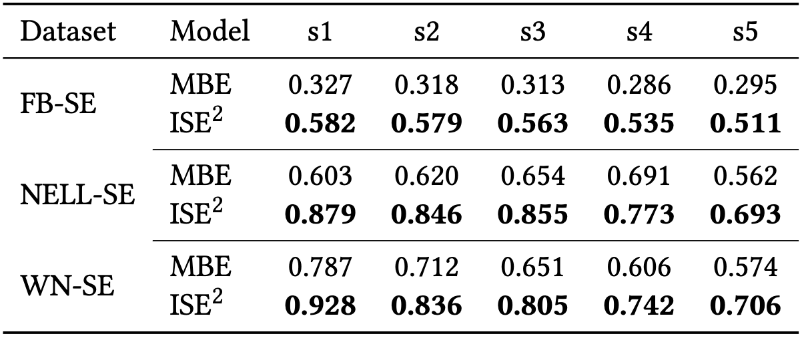
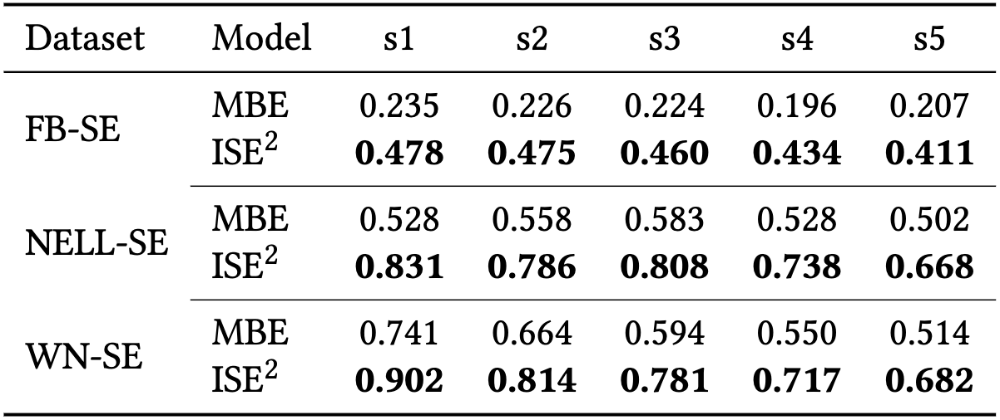
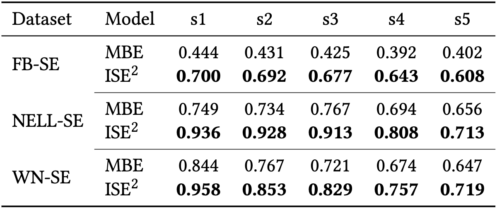
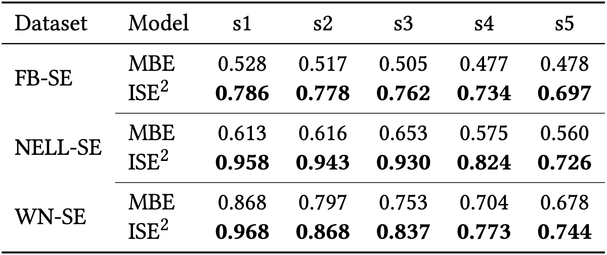

# ISE2
The source code for *Inductive Relational Link Prediction for Sequential-emerging Knowledge Graph*.

**Note that**: we have open sourced the data used in our experiments, the code about data-spliting, data-preprocessing, training, and testing.
The souce code of the model detail in "*./src/models*" will be updated if the paper is accepted.

# Complete experimental results
Due to the space limitation, we do not report all the experimental results of MRR, Hits@1, Hits@3, Hits@10 on FB-SE, NELL-SE, and WN-SE completely. Thus we present these experimental results in this page.

## ISE$^2$ vs. MBE
The complete experimental results between ISE$^2$ and MBE.

### MRR

### Hits@1

### Hits@5

### Hits@10
